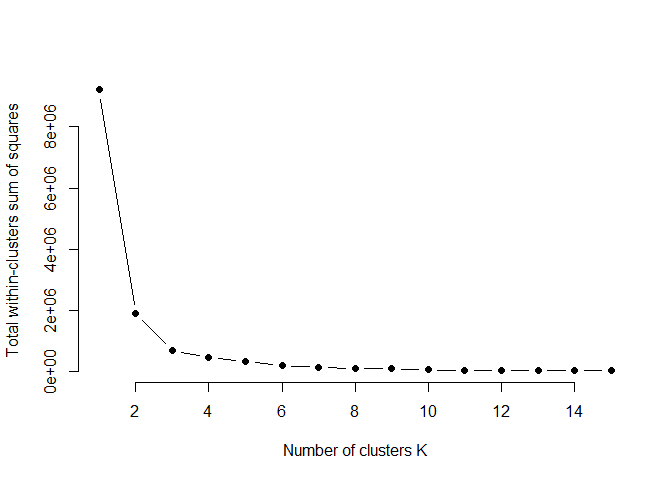
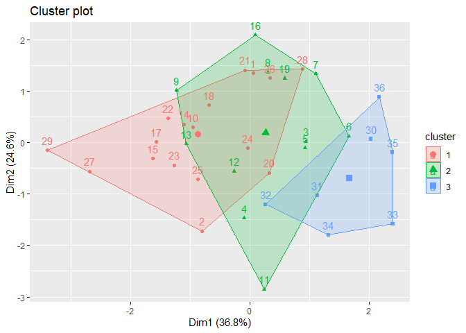

R Notebook for k-means scorings
================

  - [Data extraction, transformation and
    loading](#data-extraction-transformation-and-loading)
      - [Packages loaded](#packages-loaded)
      - [Data loading](#data-loading)
  - [K means](#k-means)
      - [Number of optimal clusters using
        Elbow](#number-of-optimal-clusters-using-elbow)
      - [Visuals](#visuals)

# Data extraction, transformation and loading

## Packages loaded

``` r
r = getOption("repos")
r["CRAN"] = "http://cran.us.r-project.org"
options(repos = r)

#data loading
if (!require("readr")) {
  install.packages("readr", dependencies = TRUE)
  library(readr)

}
```

    ## Loading required package: readr

``` r
citation("readr")
```

    ## 
    ## To cite package 'readr' in publications use:
    ## 
    ##   Hadley Wickham, Jim Hester and Romain Francois (2018). readr: Read
    ##   Rectangular Text Data. R package version 1.3.1.
    ##   https://CRAN.R-project.org/package=readr
    ## 
    ## A BibTeX entry for LaTeX users is
    ## 
    ##   @Manual{,
    ##     title = {readr: Read Rectangular Text Data},
    ##     author = {Hadley Wickham and Jim Hester and Romain Francois},
    ##     year = {2018},
    ##     note = {R package version 1.3.1},
    ##     url = {https://CRAN.R-project.org/package=readr},
    ##   }

``` r
#data manipulation
if (!require("dplyr")) {
  install.packages("dplyr", dependencies = TRUE)
  library(dplyr)
  
}
```

    ## Loading required package: dplyr

    ## 
    ## Attaching package: 'dplyr'

    ## The following objects are masked from 'package:stats':
    ## 
    ##     filter, lag

    ## The following objects are masked from 'package:base':
    ## 
    ##     intersect, setdiff, setequal, union

``` r
citation("dplyr")
```

    ## 
    ## To cite package 'dplyr' in publications use:
    ## 
    ##   Hadley Wickham, Romain François, Lionel Henry and Kirill Müller
    ##   (2020). dplyr: A Grammar of Data Manipulation. R package version
    ##   1.0.2. https://CRAN.R-project.org/package=dplyr
    ## 
    ## A BibTeX entry for LaTeX users is
    ## 
    ##   @Manual{,
    ##     title = {dplyr: A Grammar of Data Manipulation},
    ##     author = {Hadley Wickham and Romain François and Lionel {
    ##              Henry} and Kirill Müller},
    ##     year = {2020},
    ##     note = {R package version 1.0.2},
    ##     url = {https://CRAN.R-project.org/package=dplyr},
    ##   }

``` r
#data visualisation
if (!require("ggplot2")) {
  install.packages("ggplot2", dependencies = TRUE)
  library(ggplot2)
 
}
```

    ## Loading required package: ggplot2

``` r
citation("ggplot2")
```

    ## 
    ## To cite ggplot2 in publications, please use:
    ## 
    ##   H. Wickham. ggplot2: Elegant Graphics for Data Analysis.
    ##   Springer-Verlag New York, 2016.
    ## 
    ## A BibTeX entry for LaTeX users is
    ## 
    ##   @Book{,
    ##     author = {Hadley Wickham},
    ##     title = {ggplot2: Elegant Graphics for Data Analysis},
    ##     publisher = {Springer-Verlag New York},
    ##     year = {2016},
    ##     isbn = {978-3-319-24277-4},
    ##     url = {https://ggplot2.tidyverse.org},
    ##   }

``` r
#drop_na
if (!require("tidyr")) {
  install.packages("tidyr", dependencies = TRUE)
  library(tidyr)
  
}
```

    ## Loading required package: tidyr

``` r
citation("tidyr")
```

    ## 
    ## To cite package 'tidyr' in publications use:
    ## 
    ##   Hadley Wickham (2020). tidyr: Tidy Messy Data. R package version
    ##   1.1.2. https://CRAN.R-project.org/package=tidyr
    ## 
    ## A BibTeX entry for LaTeX users is
    ## 
    ##   @Manual{,
    ##     title = {tidyr: Tidy Messy Data},
    ##     author = {Hadley Wickham},
    ##     year = {2020},
    ##     note = {R package version 1.1.2},
    ##     url = {https://CRAN.R-project.org/package=tidyr},
    ##   }

``` r
#map_dbl
if (!require("purrr")) {
  install.packages("purrr", dependencies = TRUE)
  library(purrr)
 
}
```

    ## Loading required package: purrr

``` r
citation("purrr")
```

    ## 
    ## To cite package 'purrr' in publications use:
    ## 
    ##   Lionel Henry and Hadley Wickham (2020). purrr: Functional Programming
    ##   Tools. R package version 0.3.4.
    ##   https://CRAN.R-project.org/package=purrr
    ## 
    ## A BibTeX entry for LaTeX users is
    ## 
    ##   @Manual{,
    ##     title = {purrr: Functional Programming Tools},
    ##     author = {Lionel Henry and Hadley Wickham},
    ##     year = {2020},
    ##     note = {R package version 0.3.4},
    ##     url = {https://CRAN.R-project.org/package=purrr},
    ##   }

``` r
#visuals for kmeans
if (!require("factoextra")) {
  install.packages("factoextra", dependencies = TRUE)
  library(factoextra)
  
}
```

    ## Loading required package: factoextra

    ## Welcome! Want to learn more? See two factoextra-related books at https://goo.gl/ve3WBa

``` r
citation("factoextra")
```

    ## 
    ## To cite package 'factoextra' in publications use:
    ## 
    ##   Alboukadel Kassambara and Fabian Mundt (2020). factoextra: Extract
    ##   and Visualize the Results of Multivariate Data Analyses. R package
    ##   version 1.0.7. https://CRAN.R-project.org/package=factoextra
    ## 
    ## A BibTeX entry for LaTeX users is
    ## 
    ##   @Manual{,
    ##     title = {factoextra: Extract and Visualize the Results of Multivariate Data Analyses},
    ##     author = {Alboukadel Kassambara and Fabian Mundt},
    ##     year = {2020},
    ##     note = {R package version 1.0.7},
    ##     url = {https://CRAN.R-project.org/package=factoextra},
    ##   }

## Data loading

``` r
typeVars <- c("Feet", "Head", "Type","FeatherColor")
ScoringData <- 
  read_delim(
    "../Data/Scorings.csv",
    delim = ";",
    col_types = cols(
      Date = col_character(),
      Sex = col_character(),
      AnimalIdentifier = col_character(),
      Weight = col_integer(), 
      Color = col_character(), 
      Feet = col_integer(), 
      Head = col_integer(),
      Type = col_integer(), 
      FeatherColor = col_integer()
      )) %>%
  dplyr::mutate(
    AverageScore = rowMeans(select(., typeVars))
    ) %>% drop_na() %>%
  dplyr::select(
    Weight,
    Feet, 
    Head,
    Type,
    FeatherColor
  )
```

    ## Note: Using an external vector in selections is ambiguous.
    ## i Use `all_of(typeVars)` instead of `typeVars` to silence this message.
    ## i See <https://tidyselect.r-lib.org/reference/faq-external-vector.html>.
    ## This message is displayed once per session.

# K means

## Number of optimal clusters using Elbow

``` r
set.seed(123)

# function to compute total within-cluster sum of square 
wss <- function(k) {
  kmeans(ScoringData, k, nstart = 10 )$tot.withinss
}

# Compute and plot wss for k = 1 to k = 15
k.values <- 1:15

# extract wss for 2-15 clusters
wss_values <- map_dbl(k.values, wss)

plot(k.values, wss_values,
       type="b", pch = 19, frame = FALSE, 
       xlab="Number of clusters K",
       ylab="Total within-clusters sum of squares")
```

<!-- -->

## Visuals

``` r
kMeans <- kmeans(ScoringData, centers = 3)
fviz_cluster(kMeans, data = ScoringData)
```

<!-- -->
